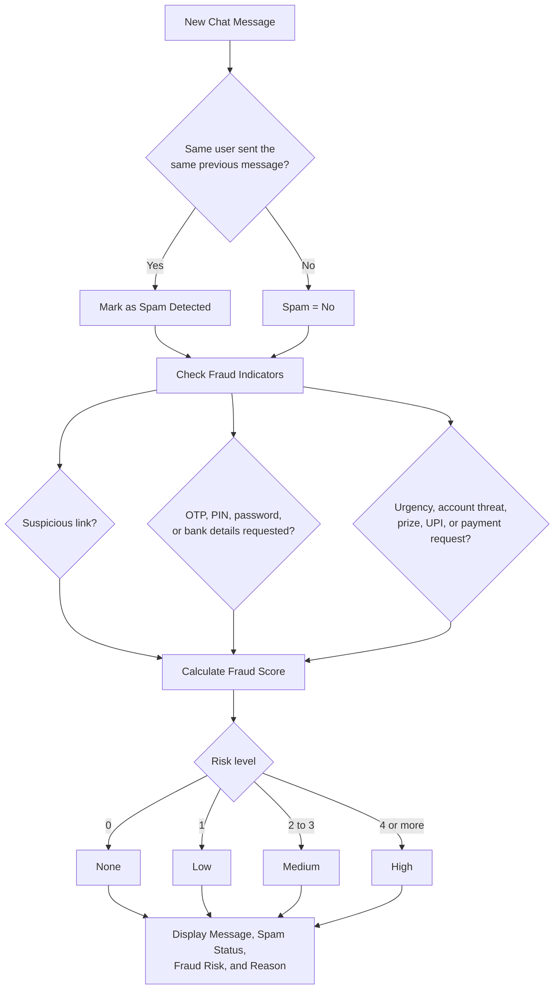

# Spam and Fraud Detection Logic

```mermaid
flowchart TD
    A[New Chat Message] --> B{Same user sent the<br/>same previous message?}
    B -->|Yes| C[Mark as Spam Detected]
    B -->|No| D[Spam = No]

    C --> E[Check Fraud Indicators]
    D --> E

    E --> F{Suspicious link?}
    E --> G{OTP, PIN, password,<br/>or bank details requested?}
    E --> H{Urgency, account threat,<br/>prize, UPI, or payment request?}

    F --> I[Calculate Fraud Score]
    G --> I
    H --> I

    I --> J{Risk level}
    J -->|0| K[None]
    J -->|1| L[Low]
    J -->|2 to 3| M[Medium]
    J -->|4 or more| N[High]

    K --> O[Display Message, Spam Status,<br/>Fraud Risk, and Reason]
    L --> O
    M --> O
    N --> O
```
