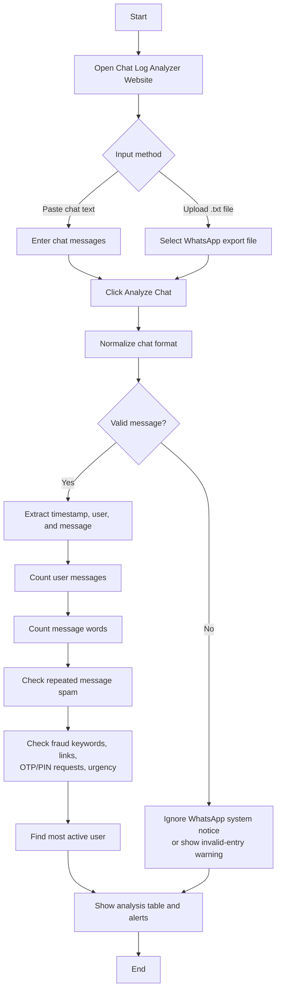

# Project Workflow

```mermaid
flowchart TD
    A[Start] --> B[Open Chat Log Analyzer Website]
    B --> C{Input method}
    C -->|Paste chat text| D[Enter chat messages]
    C -->|Upload .txt file| E[Select WhatsApp export file]
    D --> F[Click Analyze Chat]
    E --> F

    F --> G[Normalize chat format]
    G --> H{Valid message?}
    H -->|No| I[Ignore WhatsApp system notice<br/>or show invalid-entry warning]
    H -->|Yes| J[Extract timestamp, user, and message]

    J --> K[Count user messages]
    K --> L[Count message words]
    L --> M[Check repeated message spam]
    M --> N[Check fraud keywords, links,<br/>OTP/PIN requests, urgency]
    N --> O[Find most active user]
    O --> P[Show analysis table and alerts]
    I --> P
    P --> Q[End]
```
