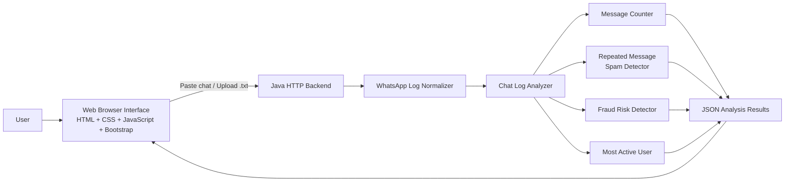

# System Architecture

```mermaid
flowchart LR
    U[User] --> W[Web Browser Interface<br/>HTML + CSS + JavaScript + Bootstrap]
    W -->|Paste chat / Upload .txt| API[Java HTTP Backend]
    API --> N[WhatsApp Log Normalizer]
    N --> A[Chat Log Analyzer]

    A --> M[Message Counter]
    A --> S[Repeated Message<br/>Spam Detector]
    A --> F[Fraud Risk Detector]
    A --> AC[Most Active User]

    M --> R[JSON Analysis Results]
    S --> R
    F --> R
    AC --> R
    R --> W
```
